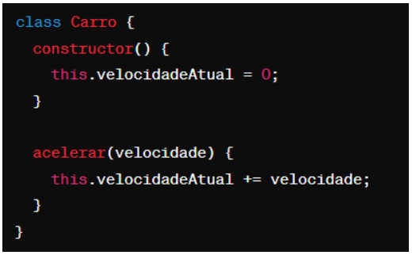

# Questões objetivas

**1)** O que o código a seguir faz?

**Minha resposta:**

**A) Imprime os números pares de 1 a 10.**

______

**2)** Identificar a linha que falta no código para criar uma classe Veiculo com atributo marca, e uma classe Carro que herda de Veiculo com um método ligar(). 

No lugar onde está escrito “// linha” qual das opções abaixo deve estar para funcionar corretamente o código?

**Minha resposta:**

**A) let carro = new Carro("Toyota")**

______

**3)** Qual é o valor de resultado após a execução deste código?

Escolha a opção que responde corretamente:

**Minha resposta:**

**A) 18**

______

**4)** Como você criaria um método `acelerar()` em uma classe `Carro`, que recebe um parâmetro `velocidade` e o adiciona a um atributo `velocidadeAtual`?

**Minha resposta:**

**A) **

______

**5)** Qual a forma correta de definir uma classe Carro em JavaScript, com um método ligar() e um atributo marca?
**Minha resposta:**

**A) **

______

**6)** Observe o código abaixo:

Qual será a saída do código acima?
**Minha resposta:**

**A) "Olá, meu nome é João. Olá, meu nome é Maria."**